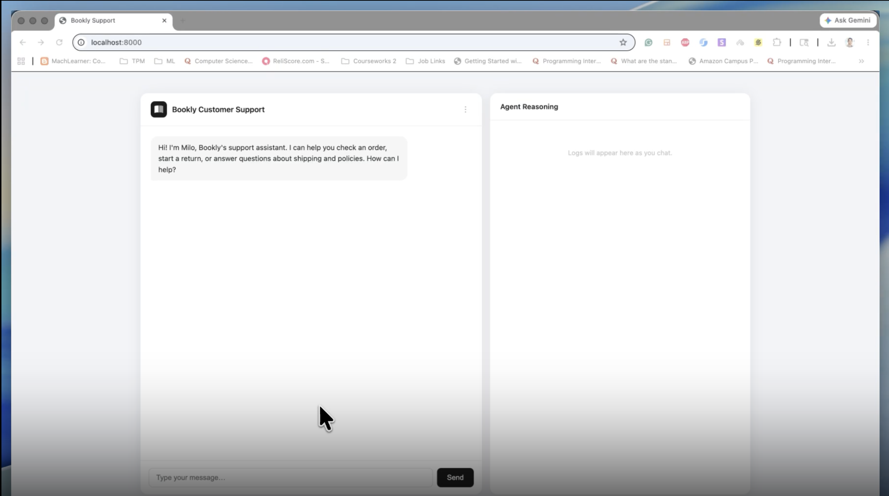

# Bookly Support Agent

## Demo

[▶ Watch the demo](https://screen.studio/share/Z4v65jBv)

[](https://screen.studio/share/Z4v65jBv)

A conversational AI customer support agent for Bookly, a fictional online bookstore. Built with Python, FastAPI, and the Anthropic Claude API.

## What it does

- **Order status** — look up real-time order information by order ID
- **Returns & refunds** — multi-turn flow that collects context and confirms before acting
- **Policy questions** — answered via semantic search over a RAG knowledge base

## Architecture

```
User (browser)
     │  HTTP
     ▼
FastAPI  (/chat endpoint)
     │
     ├── Haiku  (journey classification — matches message against journey observations)
     │
     ▼
Journey  (goal, rules, policies, scoped tools)
     │
     ▼
Agent Loop  (agent/loop.py)
  ├── Sonnet  (reasoning + tool use)
  └── Anthropic Claude API
          │  tool_use
          ▼
     Tool execution
       ├── send_otp           →  data/auth.py
       ├── verify_otp         →  data/auth.py
       ├── get_orders         →  data/orders.py
       ├── initiate_return    →  data/orders.py
       ├── initiate_exchange  →  data/orders.py
       └── search_knowledge   →  data/knowledge.py  (ChromaDB RAG)
```

Session history is stored in-memory, keyed by a per-browser UUID.

## Prerequisites

- Python 3.9+
- An [Anthropic API key](https://console.anthropic.com/)

## Setup

```bash
# 1. Clone the repo
git clone https://github.com/rohansingh131094/Customer-Support-Agent.git
cd Customer-Support-Agent

# 2. Create and activate a virtual environment
python3 -m venv venv
source venv/bin/activate      # Windows: venv\Scripts\activate

# 3. Install dependencies
pip install -r requirements.txt
```

> ChromaDB will download a local embedding model (~79MB) on first run. This is a one-time download.

```bash
# 4. Add your Anthropic API key
cp .env.example .env
# then open .env and replace with your actual key
```

## Run

```bash
uvicorn main:app --reload
```

Open [http://localhost:8000](http://localhost:8000) in your browser.

## Test scenarios

**Authentication is required for all order and return flows.** Use any 6-digit code to verify.

| Email | Phone | Name | Orders |
|---|---|---|---|
| sarah@gmail.com | 415-696-3967 | Sarah Chen | BK-2001 (delivered May 27), BK-2002 (delayed, est. Jun 1) |
| john@gmail.com | 332-275-3252 | John Doe | BK-3001 (delayed, weather hold, new est. Jun 2), BK-3002 (delivered May 27) |

Once verified, the agent has access to the customer's full profile — preferred name, member since, address on file, and card on file.

| Scenario | How to trigger |
|---|---|
| Order status | Authenticate as Sarah or John → "Where is my order?" |
| Delayed order | Authenticate as Sarah → ask about orders |
| Delayed order (weather) | Authenticate as John → ask about orders |
| Return flow | Authenticate as Sarah or John → "I want to return my order" |
| Exchange flow | Authenticate → mention a damaged or wrong item |
| Update shipping address | Authenticate → "I want to update my shipping address" |
| Policy question | "How long does shipping take?" — no auth needed |
| Escalation friction | "I want to speak to a human" → agent tries to help first |
| Out-of-scope | "What's the weather like?" |

## Project structure

```
.
├── main.py                 # FastAPI app + /chat endpoint
├── agent/
│   ├── loop.py             # Agent loop — tool-use orchestration
│   ├── tools.py            # Tool definitions + execution
│   ├── sessions.py         # In-memory session/history management
│   ├── intent.py           # Journey classification via Haiku
│   └── journeys.py         # Journey definitions (AgentConfig + Journey dataclasses)
├── data/
│   ├── orders.py           # Mock order database + return/exchange logic
│   ├── auth.py             # Mock customer directory + OTP verification
│   └── knowledge.py        # RAG knowledge base (ChromaDB)
├── static/
│   └── index.html          # Chat UI
├── requirements.txt
└── .env                    # Your API key (not committed)
```
